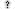

# smp-resource-pack
The nordtal.eu resource pack provides assets for the game in the form of characters within the range of `\uE000` to `\uF8FF`. It also has some vanilla overrides.

## Setup
Proper run configurations will be added soon. For now, using JetBrains Fleet, "Deploy Resourcepack" copies the contents of [`src/`](src/) into the specified `TARGET`. Only works on Windows. Make sure to adjust the `TARGET` variable to your needs in [`.fleet/run.json`](.fleet/run.json).

If you're not using Fleet, just find another way that works best for you to copy the [`src/`](src/) content into a folder inside your game's resource pack folder.

For building, just compress the contents of [`src/`](src/) into a ZIP file.

# Complete asset overview

## Default font
These characters are defined in [`minecraft/font/default.json`](src/assets/minecraft/font/default.json), making them availbale across the entire Minecraft client.

### Role tags (`\uE000` - `\uE00F`)
| Char code      | File      | Char | Description |
|----------------|-----------|------|-------------|
| `\uE000`|  |  | Settler role full tag |
| `\uE001`|  |  | Citizen role full tag |
| `\uE002`|  |  | Knight role full tag |
| `\uE003`|  |  | Lord role full tag |
| `\uE004`|  |  | Admin role short tag |

### Region flags (`\uE010` - `\uE01F`)
| Char code      | File      | Char | Description |
|----------------|-----------|------|-------------|
| `\uE010`|  |  | Other flag |
| `\uE011`|  |  | Germany flag |
| `\uE012`|  |  | Netherlands flag |
| `\uE013`|  |  | United Kingdom flag |
| `\uE014`|  |  | United States flag |

### Logo assets (`\uE020` - `\uE02F`)
| Char code      | File      | Char | Description |
|----------------|-----------|------|-------------|
| `\uE020`|  |  | Nordtal long logo transparent height 24 |
| `\uE021`|  |  | Nordtal long logo transparent height 32 |

## Bossbar font
These characters are defined in [`nordtal/font/bossbar.json`](src/assets/nordtal/font/bossbar.json) and used in the custom bossbar UI. Using MiniMessage / the nordtal formatting system it can be called with `<font:nordtal:bossbar>`.

**`minecraft/textures/font/ascii.png` is overwritten in this font file and the ascent is changed to correctly fit the characters in the UI.**

### Background tiles (`\uE000` - `\uE128`)
The background tiles are used to programmatically build a fitting background for the UI content. Their length ranges from 1 - 128 (2^n | 0 <= n <= 7).
In order to get a tile, you just have to append the desired px length from the range to an `E` and convert that to a character.

| Char code      | File      | Char | Description |
|----------------|-----------|------|-------------|
| `\uE000`|  |  | Special 1px tile with reduced height which is used at the beginning and end of every ui bar to round it off |
| `\uE001`|  |  | 1px wide tile
| `\uE002`|  |  | 2px wide tile
| `\uE004`|  |  | 4px wide tile
| `\uE008`|  |  | 8px wide tile
| `\uE016`|  |  | 16px wide tile
| `\uE032`|  |  | 32px wide tile
| `\uE064`|  |  | 64px wide tile
| `\uE128`|  |  | 128px wide tile

### Negative space (`\uF001` - `\uF128`)
These characters use the same system as the background tiles to create invisible **negative** space meassured in pixels.
We internally use this after drawing the background tiles to get back to the beginning of the UI and insert content. There is also -1px between each background tile since minecraft adds a 1px gap by default.

| Char code      | Char | Description |
|----------------|------|-------------|
| `\uF001`|  | 1px wide negative space
| `\uF002`|  | 2px wide negative space
| `\uF004`|  | 4px wide negative space
| `\uF008`|  | 8px wide negative space
| `\uF016`|  | 16px wide negative space
| `\uF032`|  | 32px wide negative space
| `\uF064`|  | 64px wide negative space
| `\uF128`|  | 128px wide negative space

### Positive space (`\uFF01` - `\uFF64`, `\u0020`)
These characters use the same system as the background tiles to create invisible **negative** space meassured in pixels.
We internally use this after drawing the background tiles to get back to the beginning of the UI and insert content. There is also -1px between each background tile since minecraft adds a 1px gap by default.

| Char code      | Char | Description |
|----------------|------|-------------|
| `\uFF01`|  | 1px wide space
| `\uFF02`|  | 2px wide space
| `\u0020`|   | 3px wide space (actual space character)
| `\uFF04`|  | 4px wide space
| `\uFF08`|  | 8px wide space
| `\uFF16`|  | 16px wide space
| `\uFF32`|  | 32px wide space
| `\uFF64`|  | 64px wide space
